# Confluent Stream Governance Demo

This demo shows a couple of useful features around Confluent Stream Governance.
A Confluent Cloud Cluster with Conenctors, ksqlDB Cluster and Schema Registry will be created. A handful tools will give all you need to demostrate or proof the features.

We will show the strong cases around Stream Governance Package advanced:
* SLA 99.95%
* Schema Registry in the region close to your cluster - Latency minimising 
* Schema Validation or kafka poison kill protection - High Quality of data, Avoid consumer crashing
* Business Metadata - How to document important infos, like ownership, contact information etc. for Topics and Schemas
* Tagging - Use tagging for later ruling
* Stream Lineage - Graph viewer, with the complete graph,  each component like producer, topic, consumers including message, metadata (topic), schema, Throughput, etc. and Creation data and business metadata of a topic
* Stream Lineage - Find bad clients
* Stream Lineage - One graph is not correct, what might the problem? Use tagging to understand and protect the teams for doing same error
* Stream Lineage - Point in Time Graph view - what changed after 2pm yesterday?
* Export Event driven model via asyncAPI format


## Start Governance Demo

to start the cluster creation execute the following steps

```bash
./01_create_ccloudcluster.sh
```

This script create

* BASIC Cluster (if you want to demo Schema Validation you need to create a dedicated cluster, change code then)
* 2 connnectors
* 1 ksqlDB cluster
* 4 clients

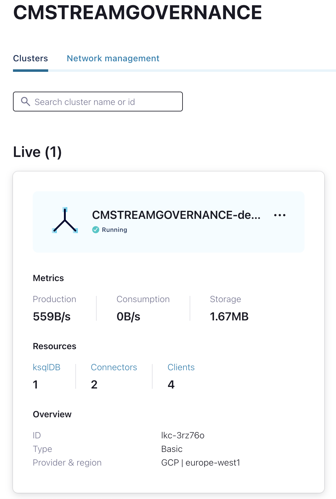

Work with dedicated cluster instead of Basic you need to change the code. Comment basic cluster creation and uncomment dedicated cluster creation on file `01_create_ccloudcluster.sh` like:

```bash
# confluent kafka cluster create $XX_CCLOUD_CLUSTERNAME --cloud "$XX_CCLOUD" --region "$XX_CCREGION" --type "basic" --environment $CCLOUD_ENVID1 -o yaml > clusterid1
confluent kafka cluster create $XX_CCLOUD_CLUSTERNAME --cloud "$XX_CCLOUD" --region "$XX_CCREGION" --type "dedicated" --availability "single-zone" --cku 1 --environment $CCLOUD_ENVID1 -o yaml > clusterid1
```

## Business MetaData for Topics and Schemas

In a multi-tenant environment is it essentials to document important information into the data catalog, so that other teams know what they need to know about the data product. In this example I want to show how to work with business metadata. In this sample we are using the API.
First I would like add business metadata to a Schema. before doing this I need Schema ID.

```Bash
# source the env variables
source source-vars 
# try, if env is set
echo $CCLOUD_SRKEY1
curl --silent -u $CCLOUD_SRKEY1:$CCLOUD_SRSECRET1 GET $CCLOUD_SRURL1/subjects/Hamburgers/versions/1 | jq .
# Output
GET $CCLOUD_SRURL1/subjects/Hamburgers/versions/1 | jq .
{
  "subject": "Hamburgers",
  "version": 1,
  "id": 100003,
  "schema": "{\"type\":\"record\",\"name\":\"Hamburger\",\"fields\":[{\"name\":\"Sandwich\",\"type\":\"string\"},{\"name\":\"Size\",\"type\":\"string\"}]}"
}
```

Now, please change the id in `data/team_data.txt` to (in my case) 100003 and add the business data to the schema.

```bash
vi data/team-data.txt
"entityName": "100003",
# Add Business Metadata Schema/Topic
# execute the curl
curl --silent -u $CCLOUD_SRKEY1:$CCLOUD_SRSECRET1  -X POST -H "Content-Type: application/json" --data @data/team-data.txt $CCLOUD_SRURL1/catalog/v1/entity/businessmetadata | jq .
# List the business metadata of Schema Hamburgers
curl --silent -u $CCLOUD_SRKEY1:$CCLOUD_SRSECRET1  -X GET $CCLOUD_SRURL1/catalog/v1/entity/type/sr_schema/name/100003/businessmetadata | jq .
```

This data can also be visible in the UI of the Schema Registy in Confluent Cloud, see right hand middle.

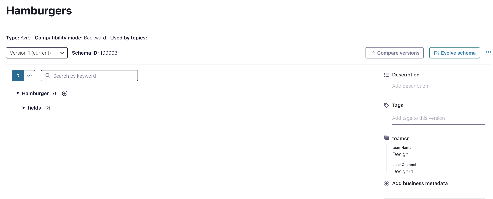

You can do the same via the UI. Let's try to add business metadata to topic cmtest1. The creation script added already some businessmetadatadefs for topics and schemas.

* teamsr
* teamtopic

Now, set Business Metadata on Topic cmtest1
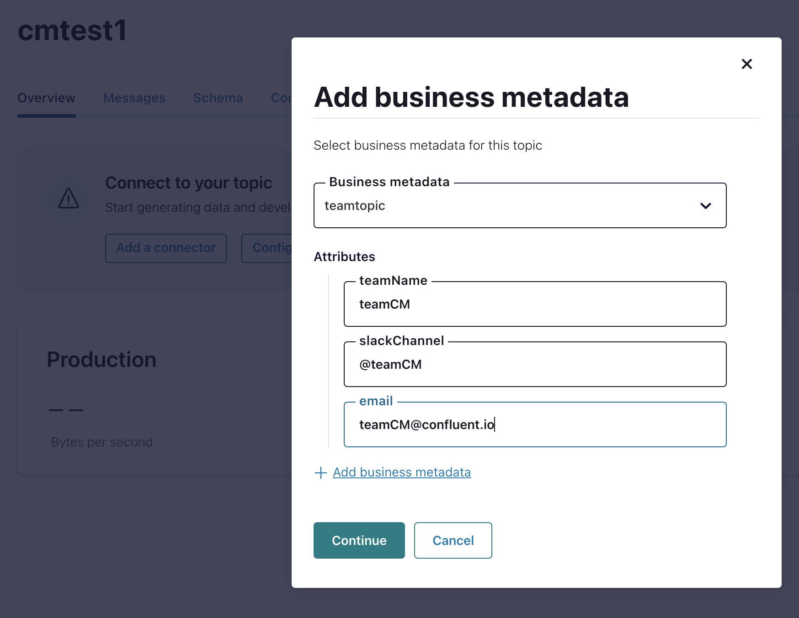

Try again, and you will see def teamtopic is not choosable anymore.
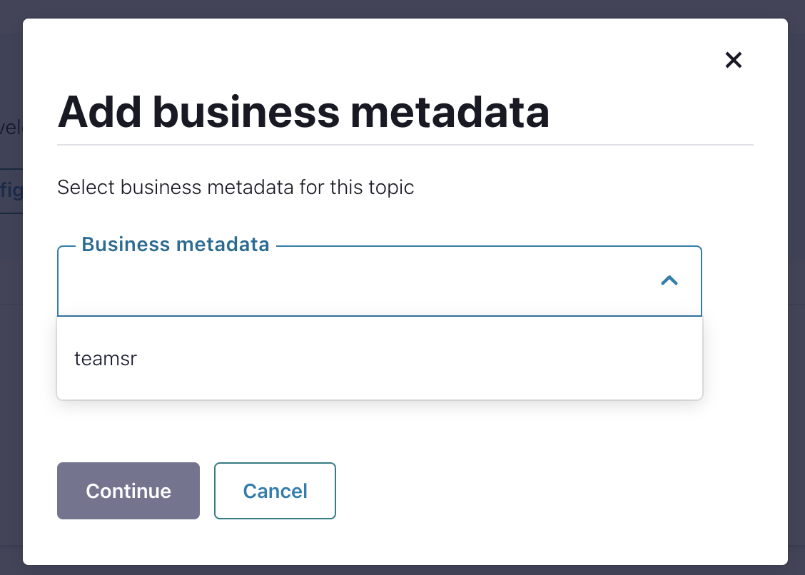

## Schema Validation

Do remember for Schema Validation we need a dedicated cluster.
We will now show what happens if you produce bad data into the cluster.

* All Consumers will crashing
* With Schema Validation, your consumers are safe.

Please start the script `00_autostart_schemavalidierung.sh`. This script open some term2 terminals and run automatically a couple of client. Then produce some bad data and you will see all consumers crashes.

```bash
# Start Schema Validation Script
cd SRValidation/
./00_autostart_schemavalidierung.sh
```

First produce correct data: All Consumers are reading that data.
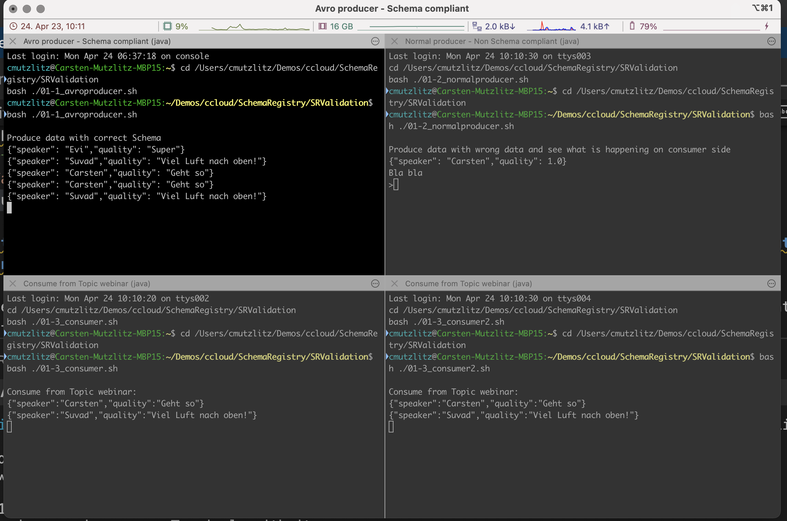

Now, produce in-correct data. See what happening, all consumer clients are crashing immediatly.
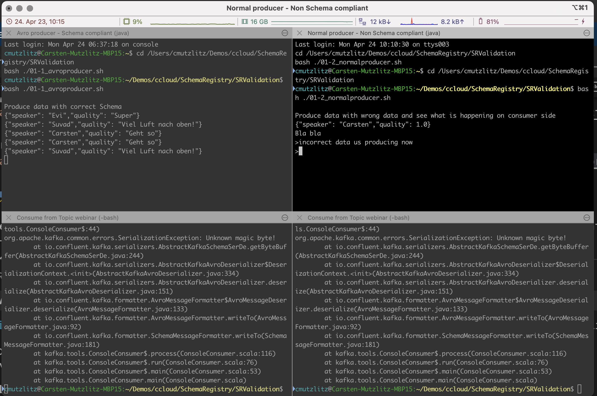

As you can see, all consumer clients crashed. With Schema Validation you can protect your clients by setting `confluent.value.schema.validation=true` at topic.

```bash
# change Schema Validation manually at topic webinar
source source-vars
confluent kafka topic update webinar --config confluent.value.schema.validation=true --environment $CCLOUD_ENVID1 --cluster $CCLOUD_CLUSTERID1
confluent kafka topic describe webinar --environment $CCLOUD_ENVID1 --cluster $CCLOUD_CLUSTERID1
```

With Schema Validation at topic you can produce again incorrect data, see what happening if you produce wrong data. As you would see the data was not produced into the cluster. This is how you guarantee best quality of data (Schema - Value). This is also well known under kafka poison pill.

## Stream Lineage

For Stream Lineage we will open a couple of new clients. So that we can see much in our data pipelines. Please do the following:

```bash
cd ..
cd Lineage/

# Do that please before executing the script
# open a new Window in iTerm2

./00_autostart_lineage.sh
```

A new Term2 Window with couple of clients were started.

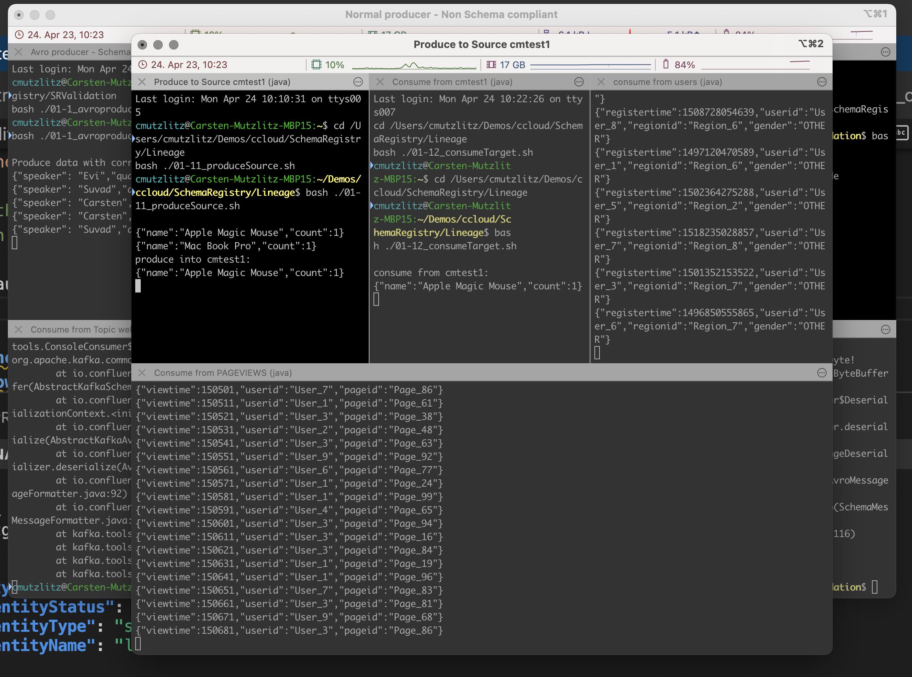

The UI of Confluent Cloud control plane can visualize the pipe as followed.

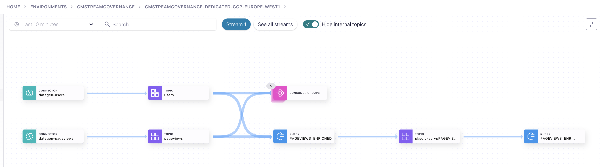

Before going into the demos, please try how to use ksql cli with Confluent Cloud:

```bash
ksql -u $CCLOUD_KSQLDBKEY1  -p $CCLOUD_KSQLDBSECRET1 $CCLOUD_KSQLDB_REST
ksql> list streams;
ksql> exit;
# Try the ksqDB API
curl -X "POST" $CCLOUD_KSQLDB_REST/query -H "Content-Type: application/vnd.ksql.v1+json; charset=utf-8" -u $CCLOUD_KSQLDBKEY1:$CCLOUD_KSQLDBSECRET1 -d $'{"ksql": "SELECT * from pageviews_original emit changes limit 1;","streamsProperties": {}}'|jq
```

### Show in Lineage Viewer

Go into the lineage UI and try out what you see from the graph

* the complete graph
* each component like producer, topic, consumers including message, metadata (topic), schema, Throughput, etc.
* Creation data and business metadata of a topic

### SHOW xterm2 Window

The script create a iTerm2 client.
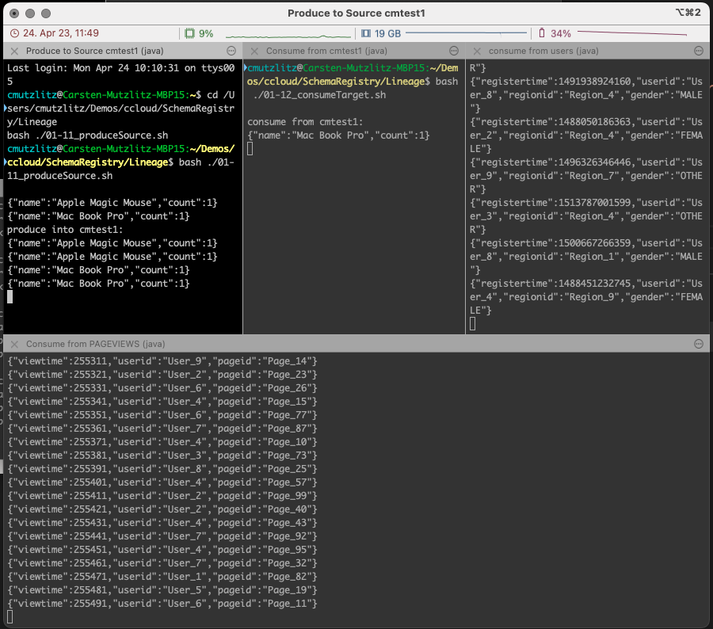

### Lineage Security: see bad clients

In the graphical flow of lineage, you can easily see, if there some clients reading data, which should not allowed.
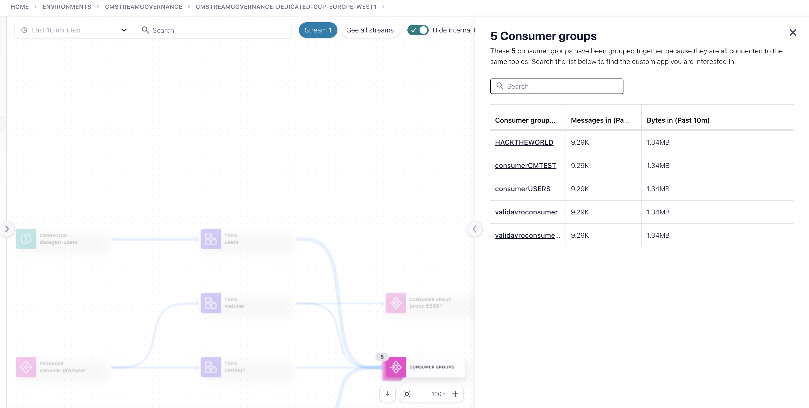

### One Graph is not complete, no consumers, something must be wrong

The Stream PAGEVIEWS_ENRICHED_FEMALE should not work, no clients consuming pagevewis_renriched_female. What is problem?
Please check users-value schema (from there all others was derived). The Gender field is deprecated. Please, add "do not use tag".

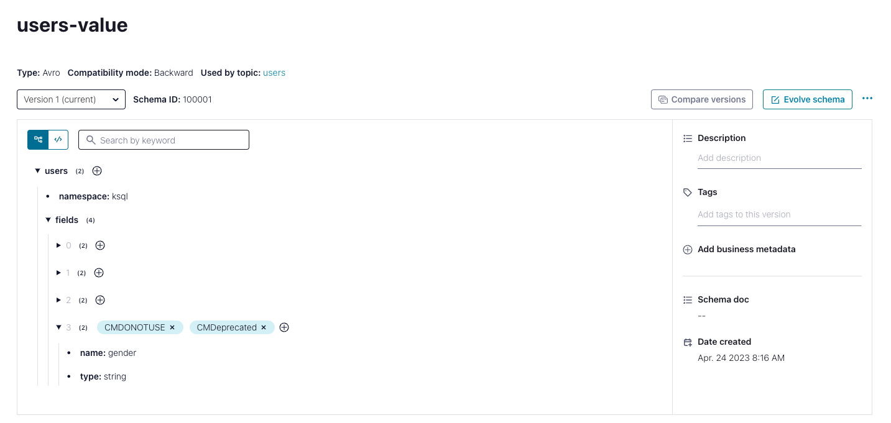

The data catalog help to find why something is not working as expected.

### Point in Time Lineage
The essential package covery only 10 min of going back of the flow in time.
The advanced package allows 7 days, see [docu](https://docs.confluent.io/cloud/current/stream-governance/stream-lineage.html#set-the-diagram-to-a-point-in-time-point-in-time-lineage).
If you you check the UI by setting different time (from - now), you will see different graphs
From 100-11:00 you will see only the topics and consumers not the ksqlDB Apps
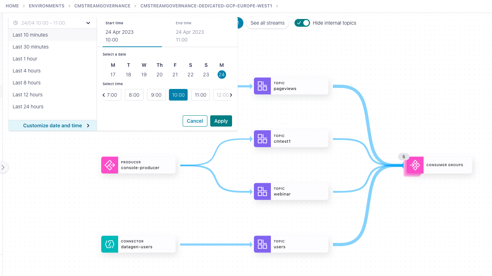

If you set from 10:00-now.
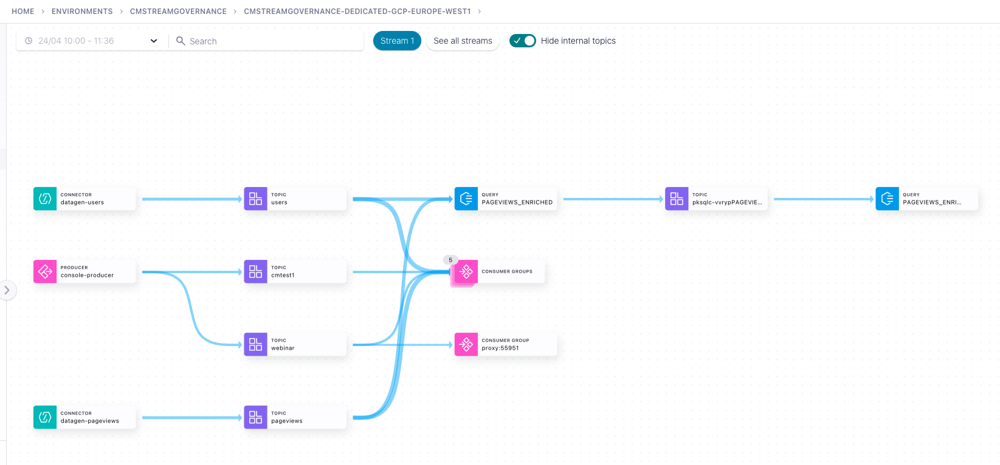


## AsyncAPI Tool export the cluster setup description
The ayncAPI Tool in confluent cli allows to import and export asyncapi yaml files.
Please see https://docs.confluent.io/cloud/current/stream-governance/async-api.html
AsyncAPI Specification is a way to capture the entire event-streaming architecture in a single document and provide the users a concise screenshot of their Confluent Kafka clusters.
To export all our topics and schema please to following:
```bash
confluent login 
source source-vars
confluent environment use $CCLOUD_ENVID1
confluent kafka cluster use $CCLOUD_CLUSTERID1
echo $CCLOUD_SECRET1
confluent api-key use $CCLOUD_KEY1 --resource $CCLOUD_CLUSTERID1
confluent schema-registry cluster describe --environment $CCLOUD_ENVID1 --api-key $CCLOUD_SRKEY1 --api-secret $CCLOUD_SRSECRET1
confluent asyncapi export --file stream_governance.yaml --kafka-api-key $CCLOUD_KEY1 --schema-registry-api-key $CCLOUD_SRKEY1 --schema-registry-api-secret $CCLOUD_SRSECRET1
cat stream_governance.yaml
```

have a look on the exported yaml file.
To import a topic with schema e.g. do the following
```bash
confluent asyncapi import --file data/AccountService2.yaml --kafka-api-key $CCLOUD_KEY1 --schema-registry-api-key $CCLOUD_SRKEY1 --schema-registry-api-secret $CCLOUD_SRSECRET1
```

## Schema Rules
We prepared a simple demo with Schema Rules. Schema Rules are execited on the client.
Please see [here](https://docs.confluent.io/cloud/current/sr/fundamentals/data-contracts.html#quick-start) the documented demo.

Requirements:

* Please close iterm2 application first
* Have Confluent Platform 7.4 installed (for the Rule classes)

Rund the Demo:
```bash
cd Rules/
# Start Ruleset Demo
./00_autostart_schemarules.sh
```

Now enter in the producer window
* {"f1": "success"}
* {"f1": "this will fail, because lengtg is >=10"}

The second attempt should fail in the producer.

# Stop Demo
first kill the terminal windows from the clients with CTRL+C or stop iTerms completely 
```bash
ps -ef | grep iterm2
kill -9 <our processid>

Now, you can delete all resources in confluent cloud, created for this demo 
```bash
cd ..
./02_drop_ccloudcluster.sh
```
